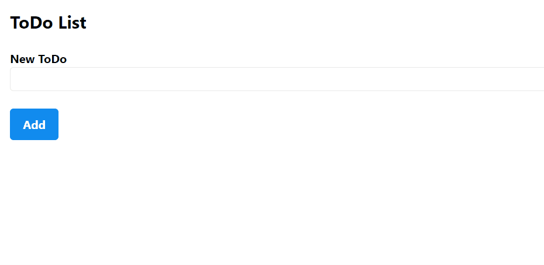

# Next.js Redux Persist Boilerplate

A ready-to-use boilerplate project that demonstrates how to use Next.js 13 with redux, redux-persist and next-redux-wrapper.

## Introduction

When looking for a solution to persist a redux store with the latest Next.js version 13, I was unable to find an out-of-the-box solution. There were always pitfalls here and there and after lengthy Google and StackOverflow research, I decided to publish my solution on GitHub for everyone to copy and use.

Inspired by the repository [with-next-redux-wrapper-redux-persist](https://github.com/fazlulkarimweb/with-next-redux-wrapper-redux-persist/tree/master).

## Features

- Latest Next.js version 13
- Redux for state management with redux toolkit (as recommended by the redux creators)
- Redux Persist for persistent state storage
- Next Redux wrapper to connect Redux and Next.js
- Basic ToDo app as an example

## Preview of the ToDo app



## Getting Started

To get started with this boilerplate project, follow the steps below:

### Prerequisites

Before you begin, ensure you have the following installed:

- Node.js: Make sure you have Node.js installed on your machine.

### Installation

1. Clone the repository:
   ```sh
   git clone https://github.com/yourusername/next-redux-persist-wrapper-boilerplate.git
   ```
2. Navigate to the project directory:
   ```sh
   cd next-redux-persist-wrapper-boilerplate
   ```
3. Install the dependencies:
   ```sh
   npm install
   ```

### Usage

Once the dependencies are installed, you can run the project using the following command:

```sh
   npm run dev
   ```

This will start the development server. Open your web browser and navigate to `http://localhost:3000` to see the app in action.

## Technologies Used

This project makes use of the following technologies and libraries:

- Next.js
- Redux
- Redux Persist
- next-redux-wrapper

## Contributing

Contributions are welcome! To contribute to this project:

1. Fork the repository.
2. Create a new branch for your feature or bug fix.
3. Make your changes and commit them.
4. Push your changes to your fork.
5. Submit a pull request to this repository. 

Please make sure to follow the code of conduct when contributing.

## License

This project is licensed under the MIT License. See the [LICENSE](LICENSE.md) file for details.

## Contact

If you have any questions or suggestions, feel free to reach out to me:

GitHub: [https://github.com/matboehm](https://github.com/matboehm)